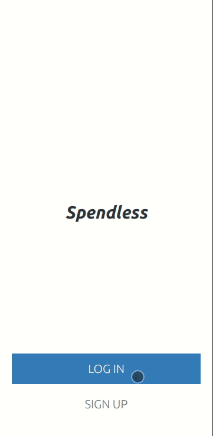

## My Recipe App

> This is a simple Ruby On Rails project. Spendless allows users to create categories and expenses for each category. It has a flexible functionality, allowing users to create one transaction in multiple categories

## Preview



Spendless is a Ruby on Rails application that allows users to keep track of their expenses and categories. Manage your own money, manage your own life

Note: As of today, Spendless only includes a mobile version. The desktop version will be coming soon

## Deployment

You can find the app [deployed in heroku](https://jf-spendless.herokuapp.com/welcome)

### Requirements
In order to work on this project, you need to have the following dependencies installed: 

- [Ruby](https://www.ruby-lang.org/en/) 
- [Postgresql](https://www.postgresql.org/)
- [Node.js](https://nodejs.org/en/)
- [Yarn](https://yarnpkg.com/)
- [Rails](https://rubyonrails.org/)

## Built With

- Languages: _**Ruby 3.1.1**_
- Frameworks: _**Ruby On Rails**_, _**TailWind CSS**_
- Technologies used: _**Visual Studio Code**_

## Getting Started

### Clone this repository

```bash
$ git clone git@github.com:JohnFTitor/spendless.git
$ cd spendless
```

### Commands to run

Run 
```bash
$ bundle install 
```

To get all the gems required for the project

Then, run

```bash
$ npm install 
```
To install packages such as style linters

To check linters locally, use
```bash
$ rubocop
$ npx stylelint "**/*.{css,scss}"
```

Once you have the project correctly set up, run 
```bash
$ bin/rails db:setup
```

To run all migrations, create the database for testing and for development, and insert some data into the database for you to visualize the changes

Finally, each time you make changes to the project, run 

```bash
$ bundle exec rspec /spec
```

In the root folder to check the consistency of the app. Please don't make changes to the tests unless completely necessary, and mention it in your PR description. 

Important note: Since this project uses Tailwind CSS for the styling, you need to run: 

```bash
$ ./bin/dev
```

For you to see the styling being applied in the browser during development

## Deployment

The deployment is handled by the owner of this repo. It is done by running

```bash
$ git push heroku dev:main
```

After the implementations where approved and merged in the development branch. Once is ready for production, it will be publish like so:

```bash
$ git push heroku main
```

## Authors

:bust_in_silhouette: **Andrés Felipe Arroyave Naranjo**

 Platform | Badge |
 --- | --- |
 **GitHub**    | [@JohnFTitor](https://github.com/JohnFTitor)
 **Twitter**   | [@johnftitor](https://twitter.com/johnftitor)
 **LinkedIn**  | [Andres](https://www.linkedin.com/in/andresarroyavenaranjo/?locale=en_US)

### Web Design

All the template colors, font, and layout distribution for the whole project were designed by [Gregoire Vella](https://www.behance.net/gregoirevella) on Behance. A link to the project [can be found here](https://www.behance.net/gallery/19759151/Snapscan-iOs-design-and-branding?tracking_source=). Check Gregoire for more amazing GUI and Graphic designs!

## 🤝 Contributing

Contributions, issues, and feature requests are welcome!

## Show your support

Give a ⭐️ if you like this project!
